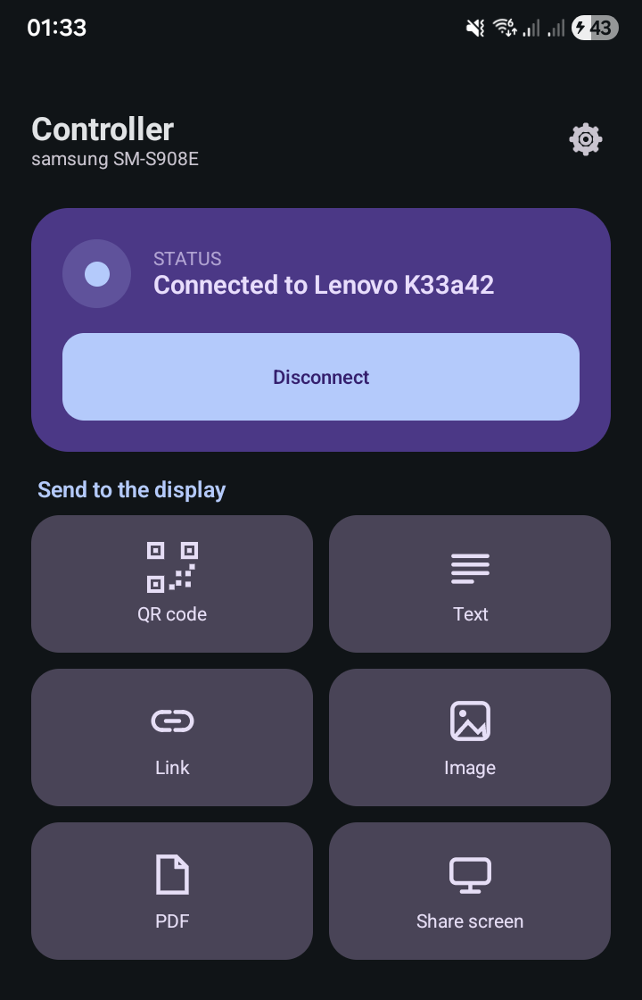
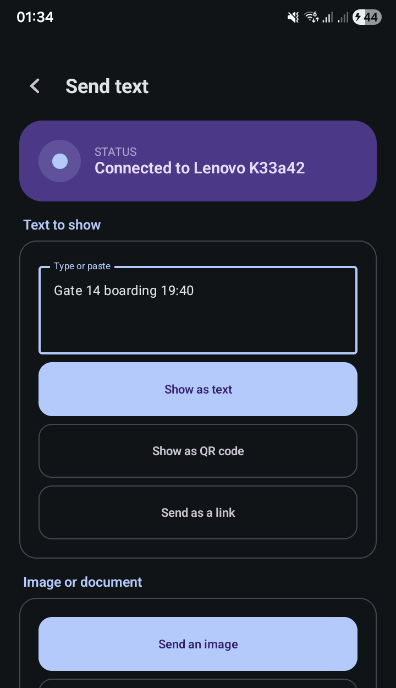
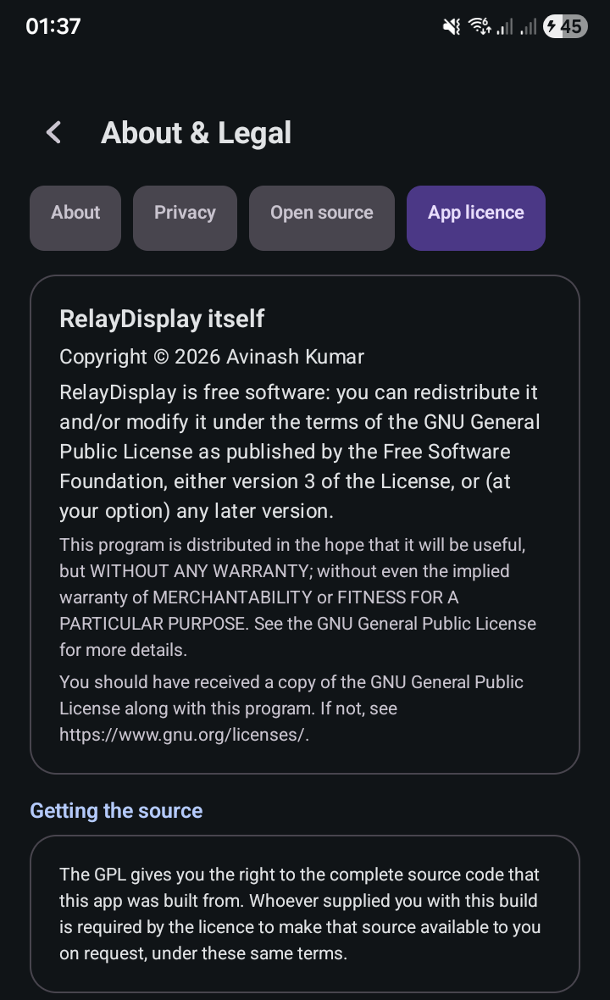
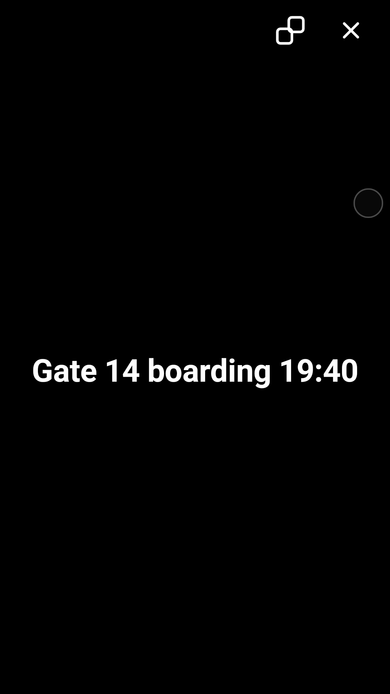
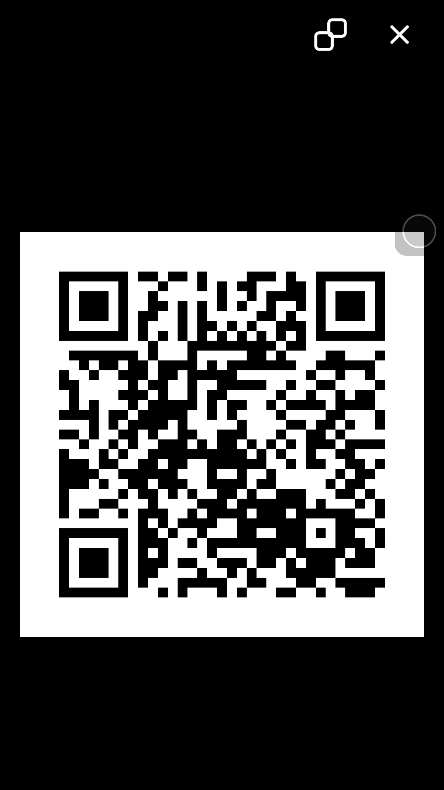
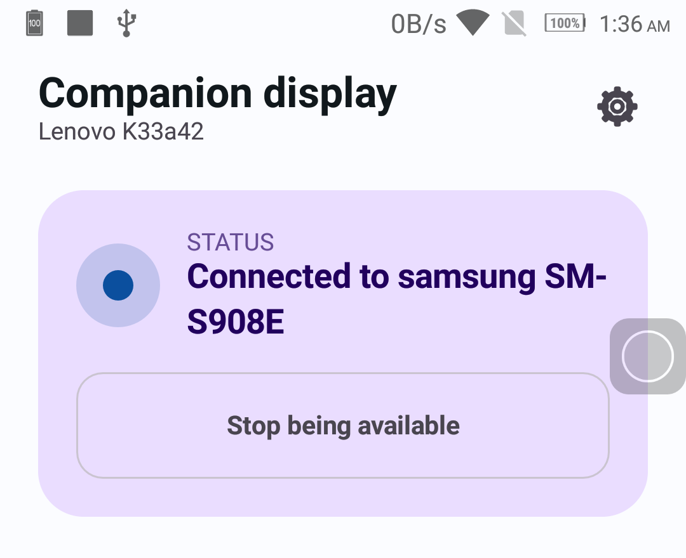

<div align="center">

# RelayDisplay

**Turn a spare Android phone into a companion screen for another phone.**

Over Wi-Fi or a hotspot. No internet, no account, no server, no cloud.

`Android 6.0+`  ·  `Kotlin 2.2.10`  ·  `Compose Material 3`  ·  `local network only`  ·  `GPL-3.0-or-later`

[](https://github.com/avina5hkr/relay-display/actions/workflows/ci.yml)

</div>

---

One APK, installed on both phones. On first launch each one picks a role:

|  | **Controller** | **Companion display** |
|---|---|---|
| **Which phone** | the one you hold — usually with your SIM and your files | the spare with the good screen, usually in a drawer |
| **What it does** | sends text, links, images, PDFs, its own screen | shows them, full screen |
| **Needs** | nothing special — a camera only if you pair by QR | nothing but a screen and Wi-Fi |

Everything travels directly between the two phones over the local network, encrypted end to end.
Nothing is uploaded anywhere, because there is nowhere to upload it to.

---

## Screenshots

Real captures from the two devices this was built against — a Galaxy S22 Ultra running the
controller in dark theme, and a Lenovo K33a42 as the display in light theme.

<table>
<tr>
<td width="33%" align="center"><br><sub><b>Controller</b><br>One tile per thing you can send</sub></td>
<td width="33%" align="center"><br><sub><b>Send</b><br>Opens on the kind you tapped</sub></td>
<td width="33%" align="center"><br><sub><b>About</b><br>The licence notice</sub></td>
</tr>
<tr>
<td width="33%" align="center"><br><sub><b>Display: text</b><br>Copy and close, top right</sub></td>
<td width="33%" align="center"><br><sub><b>Display: QR</b><br>Drawn as whole pixels</sub></td>
<td width="33%" align="center"><br><sub><b>Display: waiting</b><br>Light theme</sub></td>
</tr>
</table>

---

## Contents

- [Screenshots](#screenshots)
- [What it can do](#what-it-can-do)
- [What it cannot do](#what-it-cannot-do)
- [Supported devices](#supported-devices)
- [Building](#building)
- [Setting up](#setting-up)
- [Using it](#using-it)
- [Reconnecting](#reconnecting)
- [Power modes](#power-modes)
- [Permissions, and why](#permissions-and-why)
- [Screen mirroring limitations](#screen-mirroring-limitations)
- [How it works](#how-it-works)
- [Project layout](#project-layout)
- [Troubleshooting](#troubleshooting)
- [Documentation](#documentation)
- [Licence](#licence)

---

## What it can do

| | Feature | Notes |
|---|---|---|
| 📝 | **Text** | Any length up to 64 KiB. Unicode and line breaks survive intact. |
| 🔳 | **QR codes** | Generated on the controller, drawn as whole pixels on the display so scans do not fail on interpolation. |
| 🔗 | **Links** | Validated before sending; the display shows the destination rather than opening it behind your back. |
| 🖼 | **Images** | JPEG, PNG, WebP, GIF, HEIF. Up to 50 MiB, streamed and SHA-256 verified. |
| 📄 | **PDFs** | Page through them from the controller. |
| 🖥 | **Screen mirroring** | The controller's screen as live H.264 video. |
| 🎛 | **Remote control of that screen** | Blank it, return to the waiting screen, fit/fill, in-app brightness, full screen, rotate, page a PDF. |
| 📋 | **Copy on the display** | Text, a QR payload or a link goes to the display phone's clipboard. |
| 🔁 | **Reconnect on its own** | Pair once. After that it comes back by itself. |
| 📴 | **Work with no internet at all** | A phone hotspot with no data plan is enough. |

## What it cannot do

> **RelayDisplay is not a second monitor for Android.**
>
> No unprivileged app can make other applications lay themselves out across two phones — that
> needs system-level display APIs Android does not expose to apps. RelayDisplay shows content it
> is given, and can mirror a screen as video. Any "control" is over RelayDisplay's own window and
> nothing else.

It also deliberately does **not** use AccessibilityService, Device Admin, root, ADB, hidden APIs
or input injection, and it never captures audio. There is no analytics, no crash reporting, no
ads and no account system — see [`docs/SECURITY.md`](docs/SECURITY.md).

## Supported devices

|  | |
|---|---|
| **Minimum** | Android 6.0 (API 23) |
| **Target / compile** | Android 17 (API 37) |
| **Built and tested against** | Samsung Galaxy S22 Ultra (Android 16) as controller<br>Lenovo K6 Power / K33a42 (Android 7.0) as companion display |

Both phones must be able to reach each other on a local network. Mobile data alone will not work.

---

## Installing

**No release has been published yet.** When one is, it will appear on the
[Releases page](https://github.com/avina5hkr/relay-display/releases).

| File | What to do with it |
|---|---|
| `RelayDisplay-<version>.apk` | **This is the one you install.** Put it on both phones. |
| `RelayDisplay-<version>.aab` | Play Console upload format — **not installable**. Ignore it. |
| `RelayDisplay-<version>-mapping.txt` | R8 mapping, for deobfuscating a crash report. |
| `RelayDisplay-<version>-build-info.txt` | Which commit and signing certificate produced the build. |
| `SHA256SUMS` | Checksums — verify before installing (below). |

Verify your download first. Put `SHA256SUMS` next to the downloaded files, then:

```bash
shasum -a 256 -c SHA256SUMS   # macOS
sha256sum -c SHA256SUMS       # Linux
```

Every line must report `OK`.

Both phones need the **same** APK. Android will refuse an update signed by a different key, so
install from the same source each time.

RelayDisplay is **not on the Play Store**, and this document does not claim a timeline for that.

## Building

Requires **JDK 25** — Android Studio's bundled JBR is one, so nothing extra needs installing.

```bash
export JAVA_HOME="/Applications/Android Studio.app/Contents/jbr/Contents/Home"

./gradlew assembleDebug          # → app/build/outputs/apk/debug/app-debug.apk
./gradlew testDebugUnitTest      # 331 JVM tests, no device needed
./gradlew lintDebug              # must report 0 errors
./gradlew connectedDebugAndroidTest   # 31 tests, needs an unlocked phone
./gradlew assembleRelease        # R8-minified, unsigned
```

Install on both phones:

```bash
adb install -r app/build/outputs/apk/debug/app-debug.apk
```

<details>
<summary><b>Two gotchas worth knowing before you trust a green build</b></summary>

<br>

**`BUILD SUCCESSFUL` does not mean "installed".** The Gradle test runner has printed a successful
build while the APK failed to install with `INSTALL_FAILED_ALREADY_EXISTS`, running zero tests.
Read the run output, not the exit status. If it happens:

```bash
adb uninstall com.avinash.relaydisplay
```

**The instrumentation suite is destructive to real app state.** It resets the device role, the
operating mode *and the trusted peer*, because those tests need a genuine first-launch state to
mean anything. Running it on a phone you actually use will un-pair it. It also uninstalls the app
when it finishes.

</details>

---

## Setting up

### 1 · Choose roles

Each phone shows the chooser on first launch. Change it later in **Settings → Change device
role** — it asks for confirmation, and stops everything cleanly before switching.

### 2 · Get both phones on one network

Any of these works:

- Both on the same Wi-Fi
- The **controller's** hotspot on, display joined to it
- The **display's** hotspot on, controller joined to it

Some Android builds isolate hotspot clients from each other. If one direction does not work, try
the other.

### 3 · Pair, once

<table>
<tr><th>On the display</th><th>On the controller</th></tr>
<tr>
<td><b>Pair → Make available and show a code</b></td>
<td><b>Pair a display → Scan a pairing code</b>, and point the camera at it</td>
</tr>
</table>

If scanning is not an option, the controller can instead:

- pick the display from **Displays on this network**, or
- use **Advanced → Enter an address manually**, with the address and port the display shows under
  *Manual details*

> [!IMPORTANT]
> Either of those routes then shows a **six-digit code on both phones**. They must match.
> If they do not, cancel — something is sitting between the two phones.

---

## Using it

On the controller, tap a tile: **QR code**, **Text**, **Link**, **Image**, **PDF** or
**Share screen**. Each one goes straight where it says — the three text-shaped kinds open the
composer already set to that kind, and the file ones open the system picker directly. You can
also share text into RelayDisplay from any other app.

The controller's status line reports what the display **actually says** it is doing — Sending,
Sent, Showing, or Closed — rather than assuming the send worked.

### Closing content

Either phone can close what is on screen:

- **On the display** — tap the **✕** in the top-right corner. Next to it, a **copy** button puts
  the text, QR payload or link on that phone's clipboard.
- **On the controller** — tap **Close on display**. It is enabled only while the display reports
  it actually has something showing.

Closing never disconnects the phones, never changes a role, and never un-pairs them.

## Reconnecting

After pairing, the controller remembers the display and reconnects with one tap — or on its own
in Always Ready mode. If the link drops it retries at **1, 2, 4, 8, 15 then 30 seconds**, and the
UI says *Reconnecting* the whole time rather than pretending to still be connected.

**Settings → Forget this device** deletes the pairing and ends any session immediately.

## Power modes

| Mode | What runs | Battery |
|---|---|---|
| **On demand** *(default)* | Nothing until you tap Connect | Lowest |
| **Always ready** | Stays reachable behind an ongoing notification | Noticeably more, especially on the older phone |
| **Paused** | Nothing at all — no discovery, no sockets, no reconnects, no capture | None |

Pause keeps your pairing. It is the switch to use when you are done for the day.

## Permissions, and why

| Permission | When | Why |
|---|---|---|
| Internet | always *(manifest)* | Required for any socket, even a purely local one. The app never contacts the internet. |
| Network / Wi-Fi state | always *(manifest)* | Detect network changes without polling |
| Change Wi-Fi multicast state | while discovering | Some phones drop mDNS packets without a multicast lock |
| **Local network** | Android 17+, first connect | Android now gates reaching other devices on your Wi-Fi |
| Foreground service *(connectedDevice)* | while a session is wanted | How Android lets a connection stay alive in the background |
| Notifications | Android 13+, when a session starts | Shows the ongoing row. Denying it still leaves a working session, just a silent one. |
| Camera | only if you tap Scan | Reading the pairing code. Never recorded, never sent, and never asked for if you pair another way. |
| Foreground service *(mediaProjection)* | while sharing your screen | Required to hold screen capture |

**No location. No storage. No media permissions. No contacts.**

## Screen mirroring limitations

Mirroring works, but Android puts hard limits around screen capture and it is worth knowing them
before you rely on it:

- Android asks for permission **every single time**. That prompt cannot be skipped, and this app
  does not try to cache the consent.
- Apps that block screenshots (banking, streaming) appear **black**. That is Android protecting
  them; there is no bypass here.
- Starts around 720p at 24 fps, then steps down bitrate → frame rate → resolution if the link or
  the receiving phone cannot keep up.
- **No audio**, ever.
- Rotating the controller mid-mirror letterboxes until you restart the mirror.
- A static screen sends almost nothing. That is the encoder working correctly, not a stall.

---

## How it works

```
   CONTROLLER                                    COMPANION DISPLAY

   Compose UI                                    Compose UI
       │                                             ▲
       ▼                                             │
   ContentRouter                                 PresentationController
       │                                             ▲    authoritative about
       ▼                                             │    what is on screen
   SessionCoordinator                            ContentRouter
       │    the only writer                          ▲
       │    of connection state                      │
       ▼                                             │
   RelayEngine  ─────────────────────────────►   RelayEngine

                one encrypted TCP socket
```

**Finding each other** is mDNS (`_relaydisplay._tcp`). QR pairing and manual address entry exist
as routes that keep working when a network blocks multicast — discovery failing never blocks them.

**Securing the link** is an EC P-256 ECDH handshake into HKDF-SHA-256 and AES-256-GCM, with
separate keys per direction, the frame header bound in as AAD, and a six-digit code the user
compares on both screens. Device identity keys live in the Android Keystore and never touch the
filesystem. Full detail in [`docs/PROTOCOL.md`](docs/PROTOCOL.md) and
[`docs/SECURITY.md`](docs/SECURITY.md).

**The rule that keeps the two phones agreeing:** the display is authoritative about the display.
The controller never writes its own belief about the remote screen — sending sets *Sending* and
*Sent*, and only a report from the display can reach *Showing*. Every presentation carries a
session id and a monotonic revision, so a late message can never resurrect content that was
already closed.

## Project layout

```
RelayDisplay/
├── app/src/main/java/com/avinash/relaydisplay/
│   ├── app/            Application, dependency container, role switching
│   ├── content/        Routing, transfers, presentation state, QR encoding
│   ├── data/           Settings and trusted-peer persistence (DataStore)
│   ├── domain/model/   Roles, modes, fit, content kinds
│   ├── mirroring/      Profile negotiation, encoder, decoder
│   ├── network/        Session state machine, transport, discovery
│   ├── platform/       Permission policy, capabilities, connectivity
│   ├── protocol/       Frame codec, TLV body codec, typed messages
│   ├── security/       HKDF, AES-GCM, EC identity, handshake, pairing URIs
│   ├── service/        Foreground services and notifications
│   └── ui/             Navigation, screens and view models per role
├── app/src/test/       331 JVM tests — no device, no emulator
├── app/src/androidTest/ 31 instrumentation tests
├── diagnostics/        Field findings (captured logs are gitignored)
└── docs/               Architecture, protocol, security, testing, status
```

Roughly 16 000 lines of Kotlin across 90 source files, in a single Gradle module. The reasoning
behind that — and behind every dependency, including the ones deliberately *not* used — is in
[`docs/ARCHITECTURE.md`](docs/ARCHITECTURE.md).

---

## Troubleshooting

<details>
<summary><b>The display is not found</b></summary>

<br>

Check both phones are on the same network. Many routers and hotspots block device-to-device
traffic or filter multicast. Use QR pairing, or **Advanced → Enter an address manually** — a
discovery failure never blocks those routes.

The display must also have been made available on its own screen; it does not listen until then.

</details>

<details>
<summary><b>"Local network access is off" (Android 17+)</b></summary>

<br>

Tap the button on the dashboard, or go to **Settings → Apps → RelayDisplay → Permissions**.

</details>

<details>
<summary><b>Hotspot isolation</b></summary>

<br>

If the display's hotspot blocks clients from reaching it, use the controller's hotspot instead.

</details>

<details>
<summary><b>The connection keeps dropping</b></summary>

<br>

Check whether either phone aggressively kills background apps — common on some OEM builds — and
exempt RelayDisplay from battery optimisation **manually**. The app will not ask for that
exemption itself.

</details>

<details>
<summary><b>The QR code will not scan</b></summary>

<br>

Long payloads make a dense code. The app warns above 600 bytes (`QrEncoder.DENSE_PAYLOAD_BYTES`) and refuses above 1200
(`MAX_PAYLOAD_BYTES`). Send it
as text instead, raise the display's brightness, and clean the camera lens.

</details>

<details>
<summary><b>"Unsupported media"</b></summary>

<br>

Images must be JPEG, PNG, WebP, GIF or HEIF; documents must be PDF. Files above 50 MiB are
refused. A file whose contents do not match its declared type is also refused — that is
deliberate, not a bug.

</details>

<details>
<summary><b>"Pairing is unavailable"</b></summary>

<br>

The phone's secure keystore could not create a device identity. There is no insecure fallback, by
design. Restarting the phone sometimes clears it.

</details>

---

## Documentation

| Document | What is in it |
|---|---|
| [`docs/ARCHITECTURE.md`](docs/ARCHITECTURE.md) | Components, ownership and lifetimes, dependency choices, what stopping correctly requires |
| [`docs/PROTOCOL.md`](docs/PROTOCOL.md) | Framing, TLV encoding, message types, limits, handshake, presentation identity |
| [`docs/SECURITY.md`](docs/SECURITY.md) | Threat model, mitigations, residual risks |
| [`docs/TESTING.md`](docs/TESTING.md) | Commands, per-suite coverage, the two-device acceptance matrix and its results |
| [`docs/IMPLEMENTATION_STATUS.md`](docs/IMPLEMENTATION_STATUS.md) | What is done, what is not, and why |
| [`docs/RELEASING.md`](docs/RELEASING.md) | Signing key handling, GitHub setup, the release process and the physical two-phone checklist |
| [`diagnostics/FINDINGS.md`](diagnostics/FINDINGS.md) | Correlated two-device timelines from real-device debugging |

## Licence

RelayDisplay is free software under the **GNU General Public License, version 3 or later**.

- **SPDX identifier:** `GPL-3.0-or-later`
- **Full text:** [`LICENSE`](LICENSE) (unmodified GPL-3.0)
- **Source:** <https://github.com/avina5hkr/relay-display>

The notice says "either version 3 of the License, or (at your option) any later version", so the
correct identifier is `GPL-3.0-or-later`, not `GPL-3.0-only`.

```
Copyright (C) 2026 Avinash Kumar

This program is free software: you can redistribute it and/or modify it under
the terms of the GNU General Public License as published by the Free Software
Foundation, either version 3 of the License, or (at your option) any later
version.

This program is distributed in the hope that it will be useful, but WITHOUT ANY
WARRANTY; without even the implied warranty of MERCHANTABILITY or FITNESS FOR A
PARTICULAR PURPOSE.  See the GNU General Public License for more details.

You should have received a copy of the GNU General Public License along with
this program.  If not, see <https://www.gnu.org/licenses/>.
```

In practice that means anyone may use, study, modify and redistribute this app — but a modified
version that is distributed must ship its source under these same terms. The app satisfies the
licence's notice requirement in **Settings → About and licences → App licence**.

### Reproducing a released build

A released APK corresponds to exactly one commit. Releases are tagged, and the version shown in
**Settings → About and licences** identifies the tag to check out. Building that tag with the
documented JDK reproduces the source the binary was made from, which is what the GPL requires you
to be able to hand over.

### Third-party components

Dependencies keep their own licences, unaffected by the above. The build generates
`assets/third_party_licenses.txt` by reading the `<licenses>` block of each artifact's own POM on
the **resolved release runtime classpath** — nothing hand-written, nothing inferred.

Audit of that classpath as of this commit:

| | Count |
|---|---:|
| Components on the release runtime classpath | 165 |
| Declaring a licence in their POM | 160 |
| **Declaring no licence in their POM** | **5** |

The five that declare nothing are reported as `not declared in POM` rather than guessed:
`com.google.guava:guava`, `:failureaccess`, `:listenablefuture`,
`com.google.auto.value:auto-value-annotations` and `com.google.zxing:core`. Their licences are
well known in practice, but this repository will not assert a licence that an artifact does not
publish.

Declared licences are Apache-2.0 (158 declarations across five different spellings of the
same licence), BSD-3-Clause (2) and MIT (1) — 161 declarations across 160 components, because one
component declares two.
Apache-2.0 is one-way compatible with GPLv3. `desugar_jdk_libs` is GPL v2 with the Classpath
Exception and is used at build time.

> **Known gap.** That asset contains licence *names and URLs*, not full licence texts, copyright
> notices or `NOTICE` file contents. For a source-only distribution that is adequate; for binary
> distribution, Apache-2.0 §4 requires shipping the licence text and any `NOTICE`. Closing that
> gap is tracked in [`docs/IMPLEMENTATION_STATUS.md`](docs/IMPLEMENTATION_STATUS.md) and is not
> claimed to be done.
